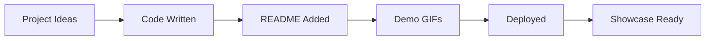

# Python-Mini-Projects

<div align="center">

# 🚀 Python Mini Projects
[](https://github.com/Hitesh77-exe/python-mini-projects)
[](https://www.python.org/)

**A curated collection of small, practical Python projects perfect for beginners & intermediate developers. Each project is standalone with full documentation!**

</div>

## ✨ Featured Projects

| Project | Description | Status |
|---------|-------------|--------|
| **Student Grade Manager** | CLI app to add/update student scores | ✅ Ready |
| **Smart Calculator** | Advanced calculator with history | 🔄 Coming Soon |
| **Todo List CLI** | Terminal-based task manager | 🔄 Coming Soon |
| **Password Generator** | Secure password creator | 🔄 Coming Soon |
| **Weather CLI** | Terminal weather checker | 🔄 Coming Soon |

## 🎯 Quick Start

```bash
# Clone the repo
git clone https://github.com/yourusername/python-mini-projects.git
cd "Python Mini Projects"

# Run any project
cd student-grade-manager
python student_grade_manager.py
```

## 📁 Project Structure
```
Python Mini Projects/
├── student-grade-manager/     # CLI Student Grade Manager
├── calculator-app/           # Smart Calculator
├── todo-list/               # Terminal Todo App
├── password-gen/            # Secure Password Generator
├── weather-cli/             # Weather Checker
└── README.md               # You're reading it!
```

## 🔥 Why This Repo?

- ✅ **Copy-Paste Ready** - No setup hassles
- ✅ **Beginner Friendly** - Well-commented code
- ✅ **Production Quality** - Proper READMEs for each project
- ✅ **Portfolio Ready** - Show off your Python skills
- ✅ **Real-World Projects** - Practical applications

## 🛠️ Tech Stack
```
Python 3.8+ | Pure Python | CLI Apps | Data Structures
```

## 🚀 How to Contribute

1. **Fork** the repository
2. **Create your project folder**: `mkdir my-cool-project`
3. **Add your Python files + README.md**
4. **Submit Pull Request** with description

```bash
git clone https://github.com/yourusername/python-mini-projects.git
cd "Python Mini Projects"
mkdir my-project
# Add your files here
git add .
git commit -m "Add my cool Python project"
git push origin main
```

## 📈 Progress Tracker



**Currently: 1/5 Projects Complete! 🎉**

## 🎁 Support the Project

⭐ **Star this repo** if you find it helpful  
📢 **Share with friends** learning Python  
🤝 **Contribute your projects** 

## 📄 License
MIT License - Use freely for learning, portfolios, and commercial projects!

---

<div align="center">
  
**Built with ❤️ for Python developers**  
*Last Updated: January 2026*
  
</div>
